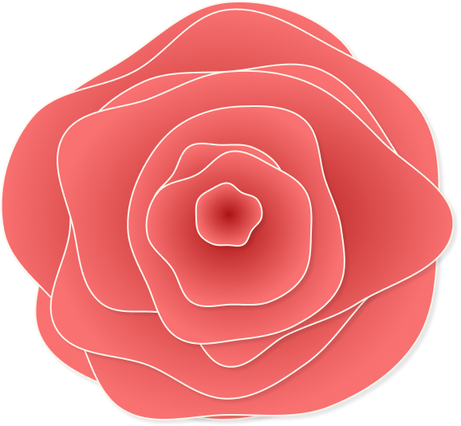

<!DOCTYPE html>
<html lang="en">

<head>
    <meta charset="UTF-8">
    <meta http-equiv="X-UA-Compatible" content="IE=edge">
    <meta name="viewport" content="width=device-width, initial-scale=1.0">
    <link rel="stylesheet" href="styles.css">

    <link rel="preconnect" href="https://fonts.gstatic.com">
    <link href="https://fonts.googleapis.com/css2?family=Nunito+Sans:wght@200&display=swap" rel="stylesheet">
    <link rel="preconnect" href="https://fonts.gstatic.com">
    <link rel="preconnect" href="https://fonts.gstatic.com">
    <link href="https://fonts.googleapis.com/css2?family=Nunito+Sans:wght@200;700;800;900&display=swap"
        rel="stylesheet">
    <link href="https://fonts.googleapis.com/css2?family=Nunito+Sans:wght@200;900&display=swap" rel="stylesheet">
    <link rel="preconnect" href="https://fonts.gstatic.com">
    <link href="https://fonts.googleapis.com/css2?family=Playfair+Display&display=swap" rel="stylesheet">
    <link rel="preconnect" href="https://fonts.gstatic.com">
    <link href="https://fonts.googleapis.com/css2?family=Playfair+Display:wght@400;600;700&display=swap"
        rel="stylesheet">

    <title>Evan Vockley | UX Design </title>
</head>

<body>
    <header>
        

            

                
            

            <ul>
                <li> About </li>
                <li> 
                    <a  href="projects.html">Work</a>
                </li>
                <li>  <a  href="contact.html">Contact</a> </li>
            </ul>
        

    </header>

    

        

            
 Hi, I'm Evan, a growing UX/UI designer. I love people and my work is part of that.
            

            
My past as a musician drives my empathy and collaboration skills. A decade of work in
                the
                fashion
                industry taught me how to problem solve on my feet, drive business, and build relationships to
                everyone's advantage.
            

            
I decided to pursue UX because it felt like coming home.
            

            <button class=primary-button type="button">Learn more</button>
        

        

            
 
            

        

    

    

    <section class="featured">
        

            <h2> Featured Projects </h2>
            
 A couple of my favorite projects 

        

        

            

                
 
                

                <h3>GoCreate</h3>
                

                    
It took some of my colleagues as long as 90 minutes to submit a custom clothing
                        order. I thought
                        someone should fix that. So I did.
                    

                    <button class="secondary-button">Read the Case Study</button>
                

            

            

                
 
                

                <h3>UnaMesa</h3>
                

                    
The Una Mesa community engagement nonprofit needed a fresh coat of paint. I was one
                        of three
                        designers who worked on the project.
                    

                    <button class="secondary-button">Read the Case Study</button>
                

            

        

        

        

            <h4>More Projects
            </h4>
            
        

    

    </section>

    <footer class="footer">
        

            

                

                    Evan Vockley
                

                

                    UX Design
                

                

                    2021
                

            

            
<button class="primary-button" "footer-button">Say Hi!</button>
            

            

                
                
                
            

        

    </footer>

</body>

</html>
